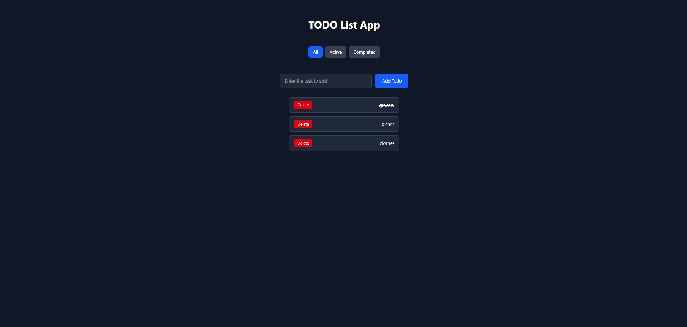

# TODO List App

A clean, responsive TODO list application built with React and Tailwind CSS.

## Screenshots




## Features

- Add new todos with a button click or Enter key
- Delete individual todos
- Mark todos as complete — strikethrough on completion
- Filter todos by **All** / **Active** / **Completed**
- Prevents adding empty todos

## Tech Stack

- [React](https://react.dev)
- [Vite](https://vitejs.dev)
- [Tailwind CSS](https://tailwindcss.com)

## Getting Started

### Clone the repo

```bash
git clone https://github.com/bibekkunwar/todo-app.git
cd todo-app
```

### Install dependencies

```bash
npm install
```

### Run locally

```bash
npm run dev
```

Open [http://localhost:5173](http://localhost:5173) in your browser.

## Live Demo

https://todo-react-app-one-theta.vercel.app

## Author

**Bibek Kunwar**
Sydney, Australia

[GitHub](https://github.com/bibekkunwar) · [Portfolio](https://bibekportfolio-github-io.vercel.app)